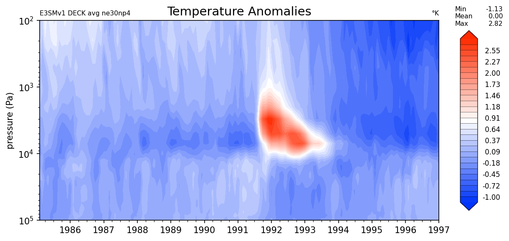

The preprocessing transforms
============================

We will now take a look at some of the preprocessing transforms. We will
use the temperature data in the last tutorial to show how it works and
what it can do. We may not use all of the preprocessing transforms, but
because they all use the same interface/API, once you know how to use
one, you know how to use them all!

Let’s load the temperature data again.

.. code:: ipython3

    # Location of the data for loading
    import os
    DATADIR = os.path.join(os.getenv("HOME"),"Research/e3sm_data/fingerprint")
    DATAFILE = "Temperature.nc"
    
    # Load the data from the data directory, using dask to help manage the memory (optional)
    import xarray
    data = xarray.open_dataarray(os.path.join(DATADIR, DATAFILE))
    print(data)

.. parsed-literal::

    <xarray.DataArray 'T' (time: 144, plev: 37, lat: 24, lon: 48)>
    [6137856 values with dtype=float32]
    Coordinates:
      * lat      (lat) float64 -84.38 -77.09 -69.76 -62.43 ... 69.76 77.09 84.38
      * lon      (lon) float64 0.0 7.5 15.0 22.5 30.0 ... 330.0 337.5 345.0 352.5
      * plev     (plev) float64 1e+05 9.75e+04 9.5e+04 ... 300.0 200.0 100.0
      * time     (time) object 1985-02-01 00:00:00 ... 1997-01-01 00:00:00

Now, let us import the preprocessing module. We will preprocess the data
using 2 ways: (1) Calling each transform separately and (2) pipeing them
together into a single transform using the sklearn Pipeline feature. The
latter has the added benefit of being more compact and reduces
redundancy in method calls.

.. code:: ipython3

    # import the preprocessing module
    import clif.preprocessing as cpp

.. code:: ipython3

    # Let's remove the seasonal/ monthly cycles
    anomalyTransform = cpp.SeasonalAnomalyTransform(cycle='month')
    data_transformed = anomalyTransform.fit_transform(data)
    print(data_transformed.shape)

.. parsed-literal::

    (144, 37, 24, 48)

Note that the data is still the same shape since we essentially
re-centered the data to highlight the anomalies. Let’s see what the
temperature data looks like now that we removed the monthly trends.

.. code:: ipython3

    # To plot the plev vs time view, we need to marginalize out the lat lon coordinate, which we can do with a transform!
    marginalTransform = cpp.MarginalizeOutTransform(dims=['lat','lon'])

.. code:: ipython3

    data_time_plev = marginalTransform.fit_transform(data_transformed)
    print(data_time_plev.shape)

.. parsed-literal::

    (144, 37)

.. code:: ipython3

    # Now let's plot the lat lon transformed data
    import clif.visualization as cviz
    
    # Initialize the contout.plot_lat_lon class with some parameters like the color map and titles
    # We use a difference color map recommended from e3sm diags
    clifplot = cviz.contour.plot_plev_time(
        cmap_name="e3sm_default_diff",
        title="Temperature Anomalies",
        rhs_title=u"\u00b0" + "K",
        lhs_title="E3SMv1 DECK avg ne30np4",
    )

.. code:: ipython3

    # Show the temperature anomalies on a time vs log(plev) plot
    clifplot.show(data_time_plev.T)

.. image:: intro_to_preproc_files/intro_to_preproc_10_0.png

.. parsed-literal::

    <clif.visualization.contour.plot_plev_time at 0x14aa2d490>

One odd effect is that the top of the atmosphere looks stretched or
distorted. That’s because when we averaged over latitude and longitude
we did a uniform averaging and did not incorporate proper latitude
longitude weights. Luckily E3SM output data comes with area weighting
tensors. We already did the leg work to extract this into an xarray
DataArray so now we just have to load it from the file system

.. code:: ipython3

    # Load the lat lon weights
    WEIGHTFILE="lat_lon_weights.nc"
    weights = xarray.open_dataarray(os.path.join(DATADIR, WEIGHTFILE))
    print(weights)

.. parsed-literal::

    <xarray.DataArray 'area' (lat: 24, lon: 48)>
    array([[0.001615, 0.001615, 0.001615, ..., 0.001615, 0.001615, 0.001615],
           [0.003735, 0.003735, 0.003735, ..., 0.003735, 0.003735, 0.003735],
           [0.005796, 0.005796, 0.005796, ..., 0.005796, 0.005796, 0.005796],
           ...,
           [0.005796, 0.005796, 0.005796, ..., 0.005796, 0.005796, 0.005796],
           [0.003735, 0.003735, 0.003735, ..., 0.003735, 0.003735, 0.003735],
           [0.001615, 0.001615, 0.001615, ..., 0.001615, 0.001615, 0.001615]])
    Coordinates:
      * lat      (lat) float64 -84.38 -77.09 -69.76 -62.43 ... 69.76 77.09 84.38
      * lon      (lon) float64 0.0 7.5 15.0 22.5 30.0 ... 330.0 337.5 345.0 352.5

Now, let us repeat the plotting, but with marginalization using the lat/
lon weights

.. code:: ipython3

    # create new marginalization transform with the weight tensor
    marginalTransform2 = cpp.MarginalizeOutTransform(dims=['lat','lon'],lat_lon_weights=weights)
    data_time_plev2 = marginalTransform2.fit_transform(data_transformed)

.. code:: ipython3

    # Show the temperature anomalies on a time vs log(plev) plot
    clifplot.show(data_time_plev2.T)

.. parsed-literal::

    <clif.visualization.contour.plot_plev_time at 0x14aa2d490>

Much better! Now, for the above example, we performed a marginalization,
seasonal anomaly transform, and a transpose, with three separate
operation calls. We can *compose* all of them into a single transform
using sklearn’s pipeline.

.. code:: ipython3

    # Import the pipeline functionality
    from sklearn.pipeline import Pipeline
    
    # Create the transform pipeline
    data_transform_pipe = Pipeline(
        steps=[
            ("anomaly", cpp.SeasonalAnomalyTransform()),
            ("marginalize", cpp.MarginalizeOutTransform(dims=["lat", "lon"], lat_lon_weights=weights)),
            ("transpose", cpp.Transpose(dims=["plev", "time"])),
        ]
    )

.. code:: ipython3

    # Now we can call the fit_transform method once to get our transformed data set
    data_new = data_transform_pipe.fit_transform(data)
    
    # Check that the size is the same
    print(data_new.shape)

.. parsed-literal::

    (37, 144)

.. code:: ipython3

    # Sanity check comparing pipeline transform to previous method
    print("Error is ",(data_new - data_time_plev2.T).sum().values)

.. parsed-literal::

    Error is  0.0

